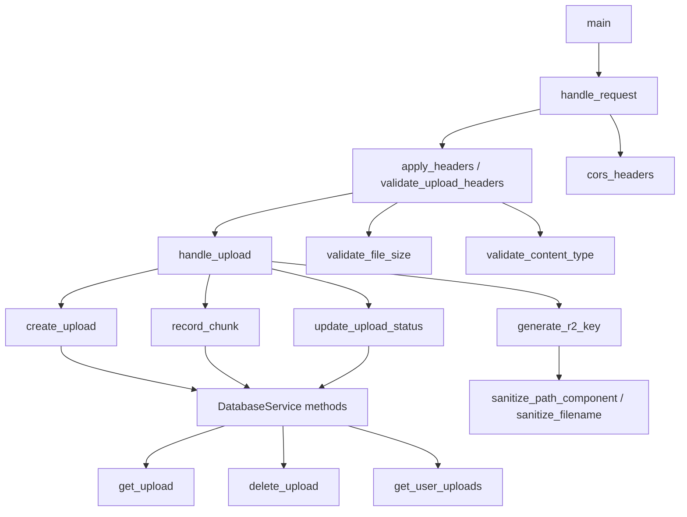

# Call Graph

_Last Updated: 2025-10-07_

## Description

Function and method invocation hierarchy.

<!--@auto:diagram:call:start-->

```mermaid
graph TD
    Main[main] --> HandleRequest[handle_request]
    HandleRequest --> ApplyMiddleware[apply_headers / validate_upload_headers]
    ApplyMiddleware --> RouteHandler[handle_upload]
    RouteHandler --> CreateUpload[create_upload]
    CreateUpload --> DBMethods[DatabaseService methods]
    RouteHandler --> RecordChunk[record_chunk]
    RecordChunk --> DBMethods
    RouteHandler --> UpdateStatus[update_upload_status]
    UpdateStatus --> DBMethods
    RouteHandler --> GenerateKey[generate_r2_key]
    GenerateKey --> Sanitize[sanitize_path_component / sanitize_filename]
    DBMethods --> GetUpload[get_upload]
    DBMethods --> DeleteUpload[delete_upload]
    DBMethods --> GetUserUploads[get_user_uploads]
    HandleRequest --> Utils[cors_headers]
    ApplyMiddleware --> ValidateFileSize[validate_file_size]
    ApplyMiddleware --> ValidateContentType[validate_content_type]
```

<!--@auto:diagram:call:end-->
