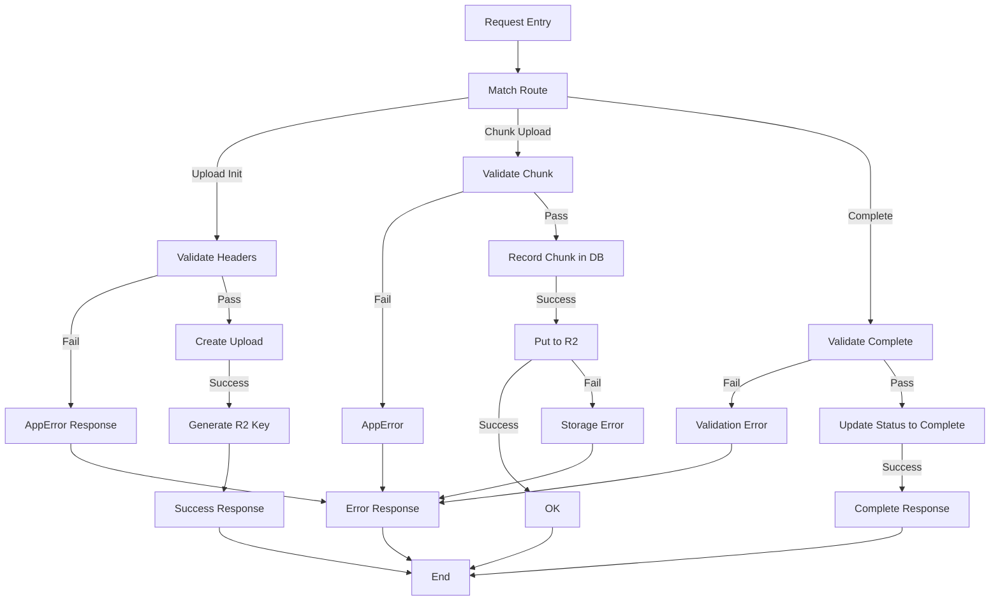

# Control Flow Graph

_Last Updated: 2025-10-07_

## Description

Branching logic in routing, validation, and error handling.

<!--@auto:diagram:cfg:start-->

```mermaid
graph TD
    Start[Request Entry] --> Route[Match Route]
    Route -->|Upload Init| Validate1[Validate Headers]
    Validate1 -->|Fail| Error1[AppError Response]
    Validate1 -->|Pass| DB1[Create Upload]
    DB1 -->|Success| KeyGen[Generate R2 Key]
    KeyGen --> Respond1[Success Response]
    Route -->|Chunk Upload| Validate2[Validate Chunk]
    Validate2 -->|Fail| Error2[AppError]
    Validate2 -->|Pass| Record[Record Chunk in DB]
    Record -->|Success| PutR2[Put to R2]
    PutR2 -->|Success| Respond2[OK]
    PutR2 -->|Fail| Error3[Storage Error]
    Route -->|Complete| Validate3[Validate Complete]
    Validate3 -->|Fail| Error4[Validation Error]
    Validate3 -->|Pass| UpdateStatus[Update Status to Complete]
    UpdateStatus -->|Success| Respond3[Complete Response]
    Error1 --> RespondError[Error Response]
    Error2 --> RespondError
    Error3 --> RespondError
    Error4 --> RespondError
    Respond1 --> End
    Respond2 --> End
    Respond3 --> End
    RespondError --> End
```

<!--@auto:diagram:cfg:end-->
