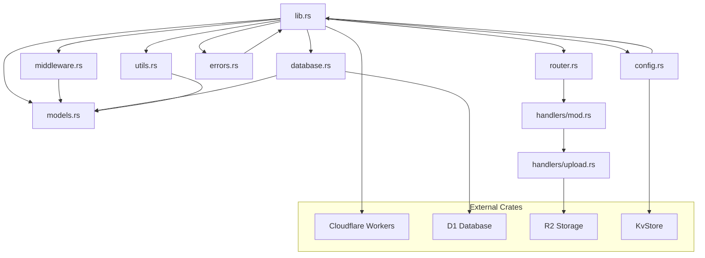

# Dependency Graph

_Last Updated: 2025-10-07_

## Description

Module and crate dependencies in the codebase.

<!--@auto:diagram:deps:start-->

```mermaid
graph TD
    Lib[lib.rs] --> Router[router.rs]
    Lib --> Middleware[middleware.rs]
    Lib --> Utils[utils.rs]
    Lib --> Errors[errors.rs]
    Lib --> Models[models.rs]
    Lib --> Config[config.rs]
    Lib --> Database[database.rs]
    Router --> Handlers[handlers/mod.rs]
    Handlers --> Upload[handlers/upload.rs]
    Middleware --> Models
    Database --> Models
    Utils --> Models
    Errors --> Lib
    Config --> Lib
    subgraph "External Crates"
        CF[Cloudflare Workers]
        D1[D1 Database]
        R2[R2 Storage]
        KV[KvStore]
    end
    Database --> D1
    Upload --> R2
    Config --> KV
    Lib --> CF
```

<!--@auto:diagram:deps:end-->
