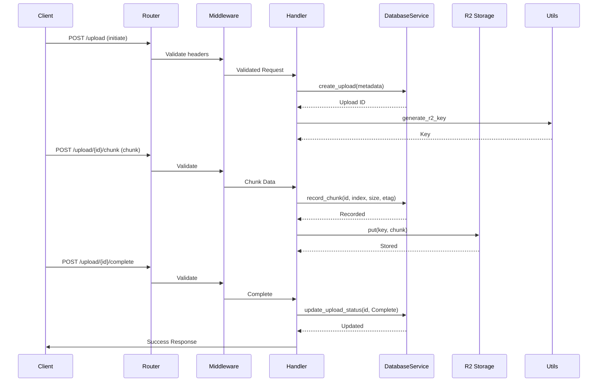

# Sequence Diagram

_Last Updated: 2025-10-07_

## Description

Detailed sequence for a chunked upload operation.

<!--@auto:diagram:seq:start-->

```mermaid
sequenceDiagram
    participant Client
    participant Router
    participant Middleware
    participant Handler
    participant DB as DatabaseService
    participant R2 as R2 Storage
    participant Utils

    Client->>Router: POST /upload (initiate)
    Router->>Middleware: Validate headers
    Middleware->>Handler: Validated Request
    Handler->>DB: create_upload(metadata)
    DB-->>Handler: Upload ID
    Handler->>Utils: generate_r2_key
    Utils-->>Handler: Key
    Client->>Router: POST /upload/{id}/chunk (chunk)
    Router->>Middleware: Validate
    Middleware->>Handler: Chunk Data
    Handler->>DB: record_chunk(id, index, size, etag)
    DB-->>Handler: Recorded
    Handler->>R2: put(key, chunk)
    R2-->>Handler: Stored
    Client->>Router: POST /upload/{id}/complete
    Router->>Middleware: Validate
    Middleware->>Handler: Complete
    Handler->>DB: update_upload_status(id, Complete)
    DB-->>Handler: Updated
    Handler->>Client: Success Response
```

<!--@auto:diagram:seq:end-->
